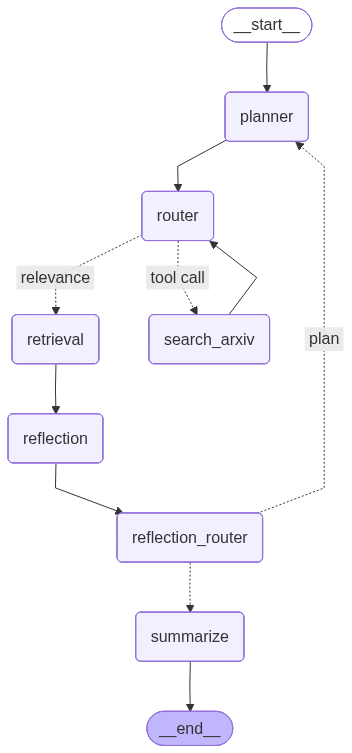
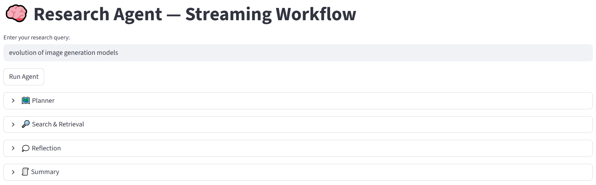
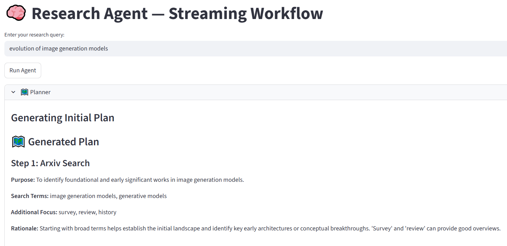
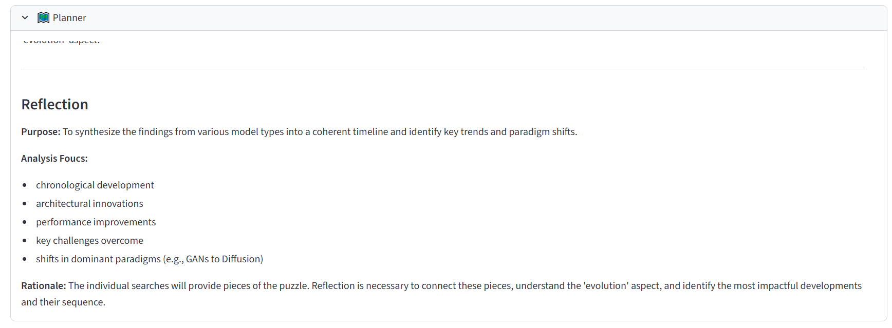
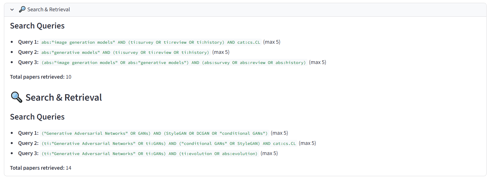
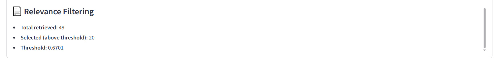
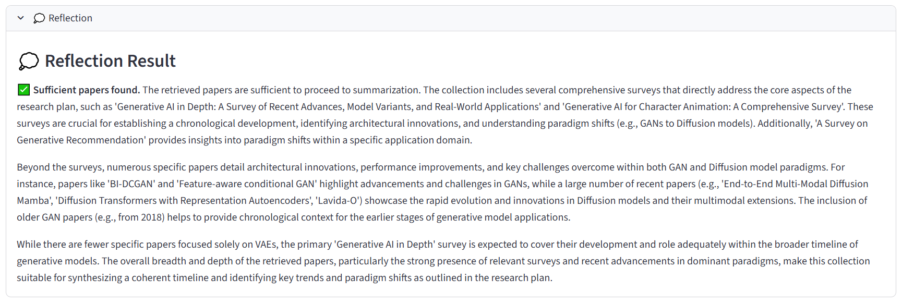
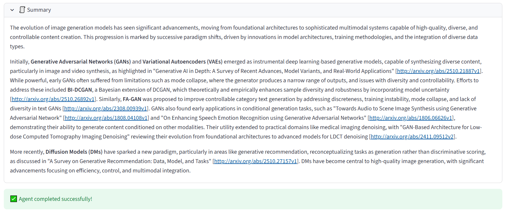

# Research Agent

An **AI Research Assistant** built using **LangGraph**, **LangChain**, **Gemini LLM**, **FastAPI**, and a **Streamlit** UI.  
This project demonstrates an **autonomous, multi-step reasoning workflow** capable of **planning, reflection, tool usage, memory, and summarization** — designed to streamline the process of literature review and research synthesis.

---

## Features

- **Agentic reasoning with planning and memory:**  
  The agent plans a sequence of research steps, executes them, and stores intermediate reflections for improved future reasoning.

- **Tool calling and orchestration:**  
  Integrates multiple tools, including an **Arxiv search API**, to retrieve and analyze relevant academic papers dynamically.

- **Streaming + Asynchronous execution:**  
  Supports real-time streaming of intermediate states, enabling live updates during long-running reasoning steps.

- **Feedback loops and re-planning:**  
  Automatically evaluates its own outputs, detects missing information, and revises its plan to gather additional evidence.

- **Similarity scoring and document filtering:**  
  Embedding-based retrieval ensures only the most relevant documents are used for reflection and summarization.

- **Complex state management:**  
  State transitions managed through **LangGraph** to ensure consistency between planner, tool, reflection, and summarization nodes.

- **Extensible architecture:**  
  Easily expandable with new tools, additional models, or alternative reflection strategies.

---

## Tech Stack

- **LLM and Embeddings:** Gemini  
- **Frameworks:** LangGraph, LangChain  
- **Backend:** Python + FastAPI (async)  
- **Frontend:** Streamlit (interactive UI)    

---

## How to Run

#### Clone the repo
```
git clone github.com/shreyas0511/AI-Research-Assistant.git
cd AI-Research-Assistant
```
#### Install requirements
```
pip install -r requirements.txt
```
#### Create a .env file with your LLM api key. I use the gemini model
```
GEMINI_API_KEY = <YOUR_API_KEY>
```
#### Run the uvicorn FastAPI server
```
cd api
uvicorn main:app --reload
```
#### You can directly test the api with curl or with FastAPI Swagger UI on http://localhost:8080/docs


#### In a separate terminal, run the streamlit frontend
```
cd frontend
streamlit run app.py
```
#### This will open the Streamlit UI connected to the FastAPI server on http://localhost:8501

---

## Workflow

The agent follows a **planner –> tool –> similarity scoring –> reflection –> summarization** loop managed by LangGraph:



The agent runs as follows:



1. **Planner Node:** Generates a structured research plan and determines which tools to invoke.





2. **Tool Node:** Executes Arxiv (or Semantic Scholar in future) searches and retrieves documents.



3. **Retrieval Node:** Calculates cosine similarity between user query + analysis focus and the papers obtained from the tool node, and uses only the most relevant papers for reflection.



4. **Reflection Node:** Evaluates results, identifies gaps, and replans if necessary.



5. **Summarization Node:** Produces the final synthesized summary.




## Future Work
**Evaluation (Evals):** Quantitative benchmarking of agent reasoning accuracy.

**Human-in-the-Loop (HITL):** Allow human feedback during re-planning or reflection stages.

**RAG Integration:** Add a persistent vector store and retrieval pipeline for long-term research memory.

**Multi-LLM orchestration:** Combine Gemini, GPT, and Claude for comparative reasoning.

**Knowledge graph visualization:** Interactive representation of document relationships and findings.

## Demo
Video coming soon ...
